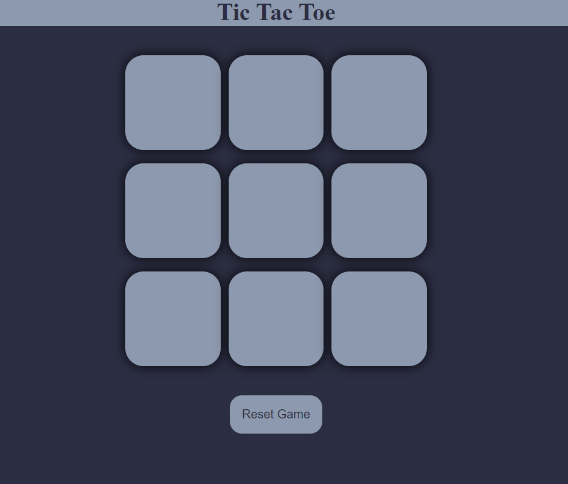
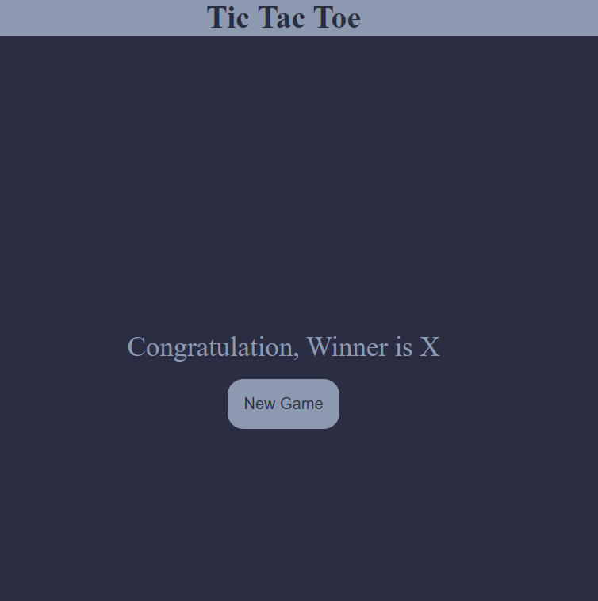

# Tic Tac Toe Game

A simple implementation of the classic Tic Tac Toe game using HTML, CSS, and JavaScript, where two players can compete to get three in a row.

## Table of Contents
- [Introduction](#introduction)
- [How to Play](#how-to-play)
- [Features](#features)
- [Screenshots](#screenshots)
- [Technologies Used](#technologies-used)

## Introduction
The Tic Tac Toe Game is a straightforward web-based version of the classic game, designed to be played by two players. The game is built using HTML for structure, CSS for styling, and JavaScript for the game logic.

## How to Play
1. Two players take turns clicking on the grid to place their mark (X or O).
2. The first player to align three of their marks horizontally, vertically, or diagonally wins.
3. If the grid is full and no player has won, the game results in a draw.

## Features
- Simple and intuitive user interface.
- Real-time win or draw detection.
- Responsive design that works on both desktop and mobile devices.

## Screenshots

### Main Game Screen

### Result Screen

## Technologies Used
- HTML5
- CSS3
- JavaScript (ES6)

